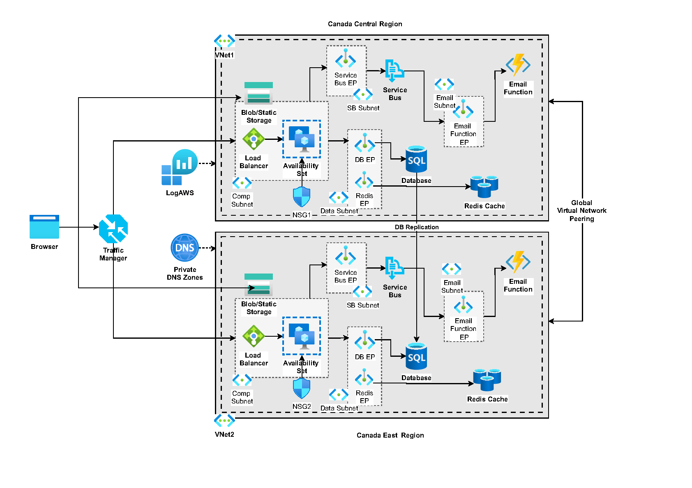

# Azure IAC Demo

This project demonstrates how to deploy a Django app on Azure, using Infrastructure-As-Code.  
The following image is the architectural diagram of the infrastructure:

# Setup

Use the following commands to setup the infrastructure:

1. Login to your account from Azure-cli
   - `az login`

2. Create the resource groups: 
   - `az group create --name network-rg --location 'Canada Central'`    
   - `az group create --name storage-rg --location 'Canada Central'`     
   - `az group create --name cache-rg --location 'Canada Central'`     
   - `az group create --name db-rg --location 'Canada Central'`     
   - `az group create --name vm-rg --location 'Canada Central'`     
   - `az group create --name sb-rg --location 'Canada Central'`     
   - `az group create --name tm-rg --location 'Canada Central'`     

2. Deploy the resources:   
   `az deployment sub create --location canadacentral --name CanadaCentralDeployment --template-file main.bicep --parameters administratorLogin='mysqladmin' administratorLoginPassword='myDBpa55w.rd123' adminUsername='azureuser' adminPassword='AzurePassw.rd'`
